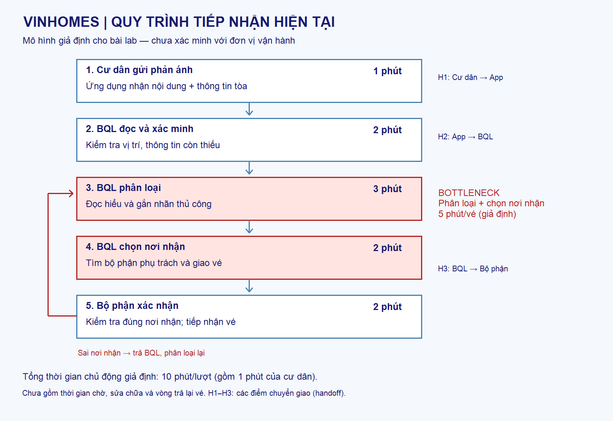
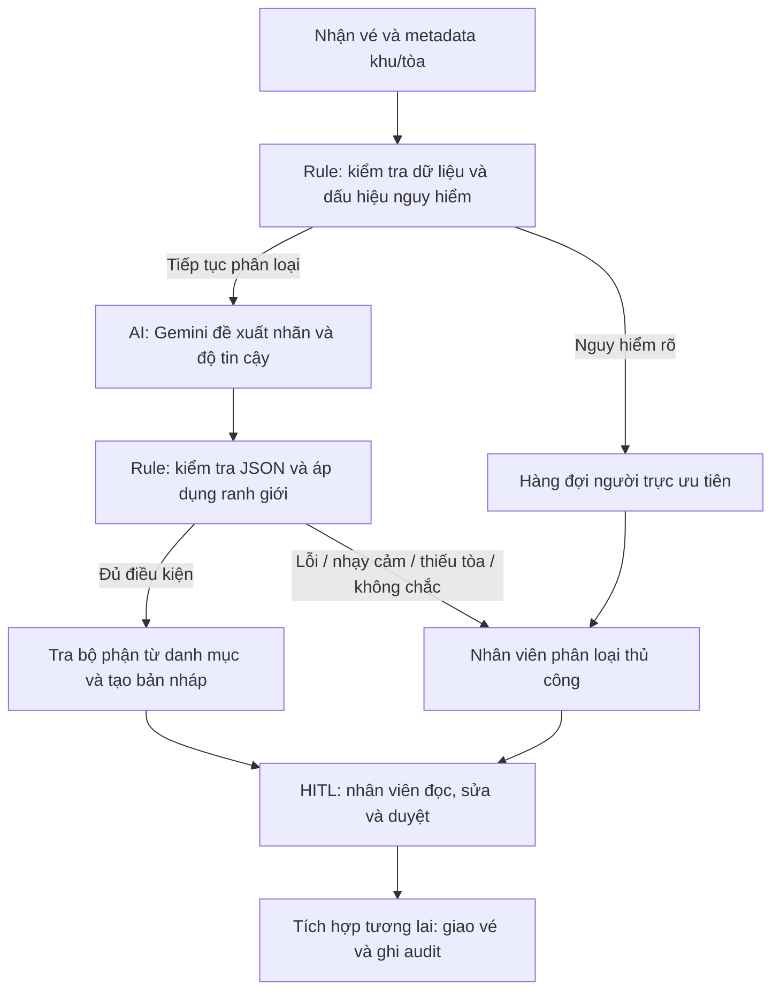

# 02 — Phân tích sâu: Phân loại và điều hướng phản ánh cư dân Vinhomes

**Trạng thái:** GO cho prototype dữ liệu giả lập; NOT YET cho vận hành thật.

Phạm vi tham chiếu: worksheet Phase 3/5 và PRD/TRD người học cung cấp. Quy trình, thời gian và mức tiết kiệm là giả định thiết kế, chưa được Vinhomes xác nhận. Sản phẩm hỗ trợ nhân viên ban quản lý, không thay thế ứng dụng cư dân.

## Phase 3 — DEEP-DIVE

### 3.1. Current-State Workflow

| Bước | Người/hệ thống | Hoạt động | Thời gian giả định | Handoff / vấn đề |
|---|---|---|---|---|
| 1 | Cư dân → ứng dụng | Gửi nội dung và thông tin tòa | 1 phút | H1: cư dân chuyển thông tin sang ứng dụng |
| 2 | Ứng dụng → nhân viên BQL | Nhân viên đọc, xác minh vị trí | 2 phút | H2: vé vào hàng đợi BQL; có thể thiếu tòa |
| 3 | Nhân viên BQL | Gắn nhãn sự cố | 3 phút | Bottleneck: đọc hiểu, nhãn không nhất quán |
| 4 | BQL → bộ phận phụ trách | Tìm nơi tiếp nhận, giao vé | 2 phút | H3: bàn giao; có thể chọn sai bộ phận |
| 5 | Bộ phận phụ trách | Kiểm tra và xác nhận tiếp nhận | 2 phút | Sai nơi nhận → trả BQL về bước 3 |

Tổng thời gian xử lý chủ động giả định: **10 phút/lượt**, gồm 1 phút phía cư dân; chưa bao gồm thời gian chờ hàng đợi và thời gian sửa chữa. Bottleneck phân loại + chọn nơi nhận = **5 phút/vé**. Vòng trả lại vé chưa được cộng vào tổng vì chưa có số liệu tần suất.

### 3.2. Problem Statement — 6 trường

| Trường | Nội dung |
|---|---|
| Actor / Operator | Nhân viên ban quản lý tòa/cụm tòa xử lý hàng đợi phản ánh |
| Current Workflow | Đọc nội dung tự do, xác minh tòa, gắn nhãn và chọn bộ phận bằng thao tác thủ công |
| Bottleneck | Phân loại và chọn nơi nhận lặp lại, mất khoảng 5 phút/vé theo giả định; có nguy cơ chuyển sai |
| Business Impact | Tăng thao tác, kéo dài thời gian chờ và phát sinh bàn giao lại. Với giả định 100 vé/ngày và giảm 5 xuống 2 phút triage, tiết kiệm gộp 300 phút/ngày trước chi phí duyệt/audit bổ sung; đây không phải lợi ích đã đo |
| Success Metric | ≥90% đề xuất nhãn + nơi nhận đúng ở vé không nhạy cảm; p95 tạo đề xuất <30 giây; triage trung vị ≤2 phút/vé; 100% ca nhạy cảm đã định nghĩa trong bộ kiểm thử được chuyển người duyệt |
| Operational Boundary | Chỉ phân loại và đề xuất. Mọi đầu ra có trạng thái DRAFT_ONLY và requires_human_review. Không gửi thông báo, đóng vé, phán xử, hoàn tiền hoặc hứa SLA. Thiếu tòa/không chắc/lỗi hệ thống → xử lý thủ công |

### 3.3. AI Fit

| Phương án | Phù hợp | Hạn chế / quyết định |
|---|---|---|
| Rule / State machine | Kiểm tra schema, mã tòa, nơi tiếp nhận; lọc dấu hiệu nhạy cảm | Từ khóa khó bao phủ cách nói và ngữ cảnh; dùng làm lớp kiểm soát và baseline |
| LLM Feature | Hiểu phản ánh tự do, chọn nhãn từ danh mục | Có thể sai nhãn hoặc tuân theo prompt injection; chọn kết hợp rule và HITL |
| Agentic Loop | Có thể thực hiện nhiều thao tác hệ thống | Không cần cho một tác vụ phân loại; tăng quyền và độ phức tạp; ngoài phạm vi |

**Lựa chọn:** một lần gọi Gemini + kiểm tra Python, không tool/action tự động.

### 3.4. Future-State Flow

Luồng này là thiết kế sản phẩm tương lai. Script lab chưa có hàng đợi, dashboard, tích hợp gửi vé hay audit bền vững. Script áp dụng bộ lọc lên nội dung gốc sau lần gọi API và cả khi API lỗi, nên **chưa thực hiện escalation tức thời trước khi chờ Gemini**. Đây là điều kiện phải bổ sung trước pilot thật.

### 3.5. Hợp đồng và ranh giới của prototype

- Nhãn: `mat_nuoc`, `hong_den`, `on_ao`, `ve_sinh`, `an_ninh`, `phi_quan_ly`, `tranh_chap`, `khac`.
- Gemini chỉ trả `category`, `confidence`, `emergency`; code tạo đầu ra cuối gồm nhãn, confidence, priority, mã tòa, escalate, route_target, draft_note, trạng thái nháp, lý do duyệt và error.
- `evaluate_prompt(text, building_id=None)` trả chuỗi JSON đã kiểm tra. Dấu `[DRAFT_ONLY]` nằm trong trường `status` để toàn bộ chuỗi vẫn parse được bằng `json.loads()`.
- Tòa chỉ nhận từ metadata `DEMO-A`/`DEMO-B` giả lập. Không lấy địa chỉ nơi nhận do mô hình tự tạo.
- Phí/tranh chấp: kiểm tra cả nhãn mô hình và dấu hiệu trong nội dung; nếu nhiều vấn đề, ưu tiên nhạy cảm. Không hỗ trợ tách thành nhiều vé trong prototype.
- Khẩn cấp: bộ lọc từ khóa hoặc cờ của mô hình bật mức emergency; luôn giữ người xử lý khi lỗi API. Bộ lọc bảo thủ có false positive, kể cả phủ định và từ mất dấu như “chạy”/“cháy”. Không tuyên bố bao phủ mọi tình huống.
- Confidence <0.6 chuyển người xử lý; nhãn thông thường chuyển `khac`, nhãn nhạy cảm được giữ để không mất lý do kiểm soát. Ngưỡng chưa hiệu chuẩn.
- Ghi chú do code tạo từ mẫu trung tính, không sao chép lời hứa giải quyết hoặc dữ liệu cá nhân từ văn bản AI.
- Chỉ dùng dữ liệu giả lập cho lab. Nội dung gọi API được gửi tới Gemini; không được coi stdout local là bảo đảm dữ liệu không ra ngoài máy.

### 3.6. Đánh giá và kế hoạch đo

| Kiểm tra | Cách đo | Trạng thái |
|---|---|---|
| Code-level boundaries | `--self-test`: mô hình giả lập phân loại sai, confidence thấp, thiếu tòa, JSON sai, ca khẩn cấp khi API lỗi | Đã chạy 16 kiểm tra offline; không chứng minh chất lượng AI |
| Adversarial model tests | 5 ca: bỏ duyệt, hoàn tiền trá hình, hạ mức khẩn cấp, tranh chấp, giả khẩn cấp | Đã định nghĩa; chưa có kết quả Gemini thành công được xác minh |
| Nhãn + nơi nhận | Tập độc lập 200 vé giả lập/được phép sử dụng, có phân bố nhóm; 2 người gắn nhãn và thống nhất bất đồng | Chưa thu thập; đo số đề xuất đúng / toàn bộ vé không nhạy cảm, không loại vé fallback khỏi mẫu số |
| Độ trễ | Đo từ nhận input tới đề xuất; báo p50/p95, tách lỗi/timeout và thời gian con người duyệt | Chưa đo |
| Lợi ích thao tác | So sánh thời gian triage có/không có AI trên nhóm vé tương đương | Chưa đo; cần tính cả thời gian sửa đề xuất |
| Nhạy cảm/khẩn cấp | Đo recall riêng, false positive, ca phủ định, không dấu và lỗi chính tả | Chưa có bộ dữ liệu đủ rộng |

Lỗi `model_request_failed` trong log người học cung cấp là lỗi yêu cầu API chưa xác định nguyên nhân, không phải bằng chứng rằng mô hình phân loại sai. Bản code bổ sung mã HTTP khi có và dừng stress-test khi API lỗi, không in Passed giả.

## Phase 5 — EVALUATE

| Readiness checklist | Đánh giá | Việc còn thiếu |
|---|---|---|
| Có dữ liệu mẫu/log sạch? | Một phần: có ca giả lập, chưa có log thật | Thu thập được phép, khử PII, gắn nhãn, tách tập test |
| Rủi ro AI sai có được kiểm soát? | Có kiểm tra code và trạng thái duyệt trong lab; chưa xác minh vận hành | Tích hợp quyền duyệt, hàng đợi khẩn cấp, audit và kiểm thử rộng |
| Stakeholder sẵn sàng thay đổi? | Chưa có bằng chứng | Xác nhận với BQL, bộ phận nhận vé và người chịu trách nhiệm dữ liệu |

**GO cho prototype scope hẹp, dữ liệu giả lập. NOT YET cho pilot có người dùng/dữ liệu thật.** Chưa có bằng chứng để tuyên bố sẵn sàng production hoặc đạt mục tiêu 90%.

Điều kiện chuyển sang pilot: API chạy thành công; chốt danh mục tòa/bộ phận; đo baseline và bộ test; xác định xử lý dữ liệu; có người duyệt và đường chuyển khẩn cấp; thiết lập audit/rollback về thủ công. Pilot giới hạn nước, điện, ồn, vệ sinh tại một cụm. Phí và tranh chấp tiếp tục do người quyết định.
